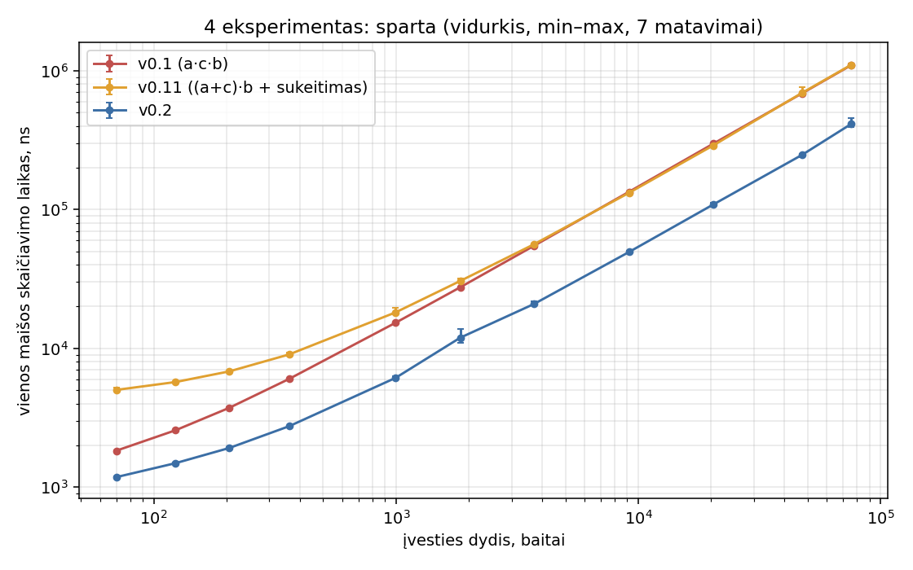
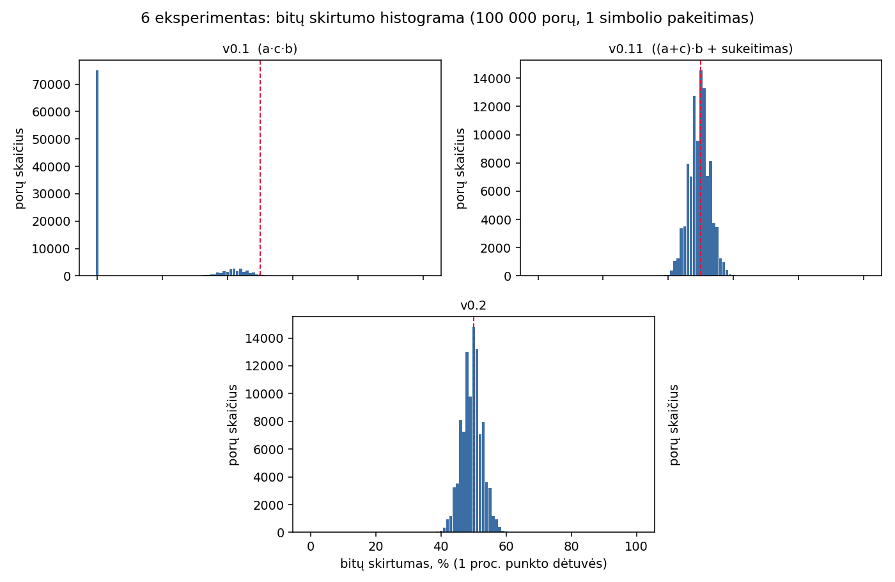

# Mokomoji maišos funkcija (Blokų grandinių technologijos, 1 užduotis)

> **Svarbu.** Tai mokomasis algoritmas. Jis skirtas mokymuisi, o ne slaptažodžiams, pinigams ar realioms sistemoms saugoti.
> Nerastos kolizijos ir geras lavinos efektas **neįrodo** kriptografinio saugumo (žr. 8 skyrių).

## Turinys
1. [Santrauka](#1-santrauka)
2. [Paleidimas](#2-paleidimas)
3. [Įvestis, išvestis ir apribojimai](#3-įvestis-išvestis-ir-apribojimai)
4. [Algoritmas ir projektavimo sprendimai](#4-algoritmas-ir-projektavimo-sprendimai)
5. [Versijos](#5-versijos)
6. [Eksperimentų aplinka ir atkuriamumas](#6-eksperimentų-aplinka-ir-atkuriamumas)
7. [Rezultatai (1–7 eksperimentai)](#7-rezultatai-17-eksperimentai)
8. [Išvados (8 eksperimentas)](#8-išvados-8-eksperimentas)
9. [DI naudojimas](#9-di-naudojimas)
10. [Šaltiniai](#10-šaltiniai)

## 1. Santrauka

Sukurta 256 bitų (64 hex skaitmenų) maišos funkcija, paremta keturiomis 64 bitų „juostomis“ (angl. *lanes*) ir daugyba moduliu 2⁶⁴.
Trys versijos buvo matuotos tais pačiais testais:

| Versija | Esmė | Pagrindinis rezultatas |
|---|---|---|
| **v0.1** | `a[i] = a[i]·c·b[i]` | Lavinos efektas griūva: 74,95 % porų turi **< 1 %** bitų skirtumą; įvestims ≥ 500 baitų visos maišos sutampa; perstatos ir `\0` baitas sukelia kolizijas |
| **v0.11** | `a[i] = (a[i]+c)·b[i]` + sukeitimas po maišos | Lavina ~50 %, kolizijų nerasta; sukeitimas lėtina trumpas įvestis, o jo atskiras poveikis nepamatuotas |
| **v0.2** | 8 baitai per žingsnį, netiesinis xorshift, juostų maišymas, finalizacija | Lavina 50,00 % / 93,74 %, kolizijų nerasta, ~2,7× greitesnė už v0.11 didelėms įvestims |

Visi 8 eksperimentai atlikti. Kolizijų **neradimas** 256 bitų išvestyje yra įprastas rezultatas ir nieko neįrodo (žr. 7.5 ir 8 skyrius).

## 2. Paleidimas

### Kompiliavimas
Failai: `main.cpp`, `mylib.cpp`, `mylib.h`, `tests.cpp`, `tests.h` (C++17). `main.cpp` naudoja `windows.h` (konsolės UTF-8 režimui), todėl programa kompiliuojama Windows (MSVC arba MinGW); kiti failai yra perkeliami.

```bash
g++ -O2 -std=c++17 main.cpp mylib.cpp tests.cpp -o hash     # MinGW
```
Visual Studio: C++17, **Release** konfigūracija (matavimai Debug režimu nėra reprezentatyvūs).

### Meniu
```
Pasirinkite įvedimo būdą:
[1] - Įvedimas ranka
[2] - Skaitymas iš failo
[3] - Testai (eksperimentai)
```
- **[1]** ranka įvedamos eilutės (tuščia eilutė – pabaiga), **[2]** skaitomas nurodytas failas. Kiekviena eilutė maišoma atskirai (3 skyrius). Išvedimas į ekraną arba į `isvedimas.txt`; eilutės formatas: `maiša  įvestis ilgis_baitais`.
- **[3]** paleidžia eksperimentus (`0` – visus, `1`–`7` – pasirinktą). Įvesties failai ir `konstitucija.txt` imami iš `tests/`.
  Rezultatai išsaugomi: `determinism_run.txt`, `efficiency.csv`, `avalanche_raw.csv`, `avalanche_hist.csv`.
  

### Katalogų struktūra
```
main.cpp  mylib.cpp  mylib.h  tests.cpp  tests.h  sha256.cpp  sha256.h
tests/      - testiniai failai (1–3 eksperimentai) ir konstitucija.txt (4 eksperimentas)
results/    - pradiniai eksperimentų išvedimai ir CSV
docs/       - grafikai
```

## 3. Įvestis, išvestis ir apribojimai

- **Kodavimas.** Maišoma **baitų seka**; funkcija nieko nenormalizuoja: nešalinami tarpai, nekeičiamas raidžių registras, nekeičiamos eilučių pabaigos. Tekstas koduojamas UTF-8 (Windows konsolė nustatoma į CP 65001), todėl `ą` yra 2 baitai. Pvz. `utf8_lt.txt`: 38 baitai, 27 simboliai.
- **Failų turinys.** Testų režime (**[3]**) maišomi **tikslūs failo baitai** (`readFileBytes`, dvejetainis skaitymas). Neperskaitomas failas – klaida (išimtis), o ne tuščia įvestis.
- **Rankinis ir failo režimai ([1], [2]).** Kiekviena eilutė maišoma **atskirai**; eilutės pabaigos simbolis (Enter sukuriamas `\n`, failo `\r\n`) į maišą **neįtraukiamas**. Todėl `Lietuva` (7 baitai) ir `Lietuva\n` (8 baitai) šiuose režimuose duoda tą pačią maišą, o testų režime – skirtingas (`text.txt` ir `text_nl.txt`).
- **Fiksuotas ilgis.** 256 bitai = 32 baitai = **64 hex skaitmenys**, mažosios raidės, išsaugomi pradiniai nuliai. Tuščia įvestis leidžiama (`empty.txt`, 0 baitų).
- **Dydžio apribojimai.** Visa įvestis laikoma `std::string` atmintyje, todėl riba – laisva RAM. Įvesties ilgis į maišą įmaišomas kaip 64 bitų skaičius (v0.2). Praktiškai išbandyta iki 10 000 B atsitiktinių duomenų ir 75 595 B tekstinio failo (`konstitucija.txt`).
- **Determinizmas.** Maiša priklauso tik nuo įvesties baitų: nenaudojamas laikas ar `std::random_device`; pradinės konstantos gaunamos iš `std::mt19937_64` su **fiksuotu seed** (žr. 4 skyrių).

### Žinomi trūkumai
- Meniu režimai [1]/[2] maišo eilutes atskirai, o ne visą failą kaip vieną baitų srautą; viso failo baitai maišomi tik testų režime.

## 4. Algoritmas ir projektavimo sprendimai

### Bendra pradžios būsena (v0.1, v0.11, v0.2)
Keturios 64 bitų juostos `a[0..3]` ir keturios konstantos `b[0..3]` gaunamos iš `std::mt19937_64`, inicializuoto fiksuotu `SETUP_SEED = 0x5EED0F1A5C0DE001`:
```
gen  ← mt19937_64(SETUP_SEED)
a[i] ← gen() | 1        (i = 0..3)
b[i] ← gen() | 1        (i = 0..3, kiti keturi kvietimai)
```
- `std::mt19937_64` išvestis nustatyta standarto, todėl nesikeičia tarp kompiliatorių ir OS. Nenaudojami `std::*_distribution` (jų išvestis priklauso nuo bibliotekos).
- `| 1` – nelyginiai skaičiai: daugyba iš nelyginio skaičiaus moduliu 2⁶⁴ yra grįžtama ir neprarandami jaunesni bitai.
- Konstantos apskaičiuojamos vieną kartą ir yra `const`, todėl tarp `hash()` kvietimų būsena neišlieka.

### v0.1
```
HASH(baitai):
    a ← pradinė a
    kiekvienam baitui c:
        kiekvienai juostai i = 0..3:
            a[i] ← a[i] · c · b[i]            (mod 2^64)
    grąžinti hex(a[0]) ‖ hex(a[1]) ‖ hex(a[2]) ‖ hex(a[3])   // po 16 hex, mažosios, su pradiniais nuliais
```
Pagrindimas: paprasta idėja – kiekvienas baitas „daugina“ būseną, o skirtingos konstantos `b[i]` išskiria juostas.

### v0.11
```
    ... a[i] ← (a[i] + c) · b[i]              (vietoj a[i]·c·b[i])
    H ← hex eilutė (64 simboliai)
    G ← mt19937_64(seed = a[0])
    i ← 0, j ← 63
    kol i < j:
        jei (G() >> 63) = 1: sukeisti H[i] ir H[j]       // 50/50
        i ← i + 1, j ← j − 1
    grąžinti H
```
Pagrindimas: `(a+c)·b` nebėra komutatyvi, todėl simbolių tvarka ir nulinis baitas nebe naikina būsenos. Sukeitimas po maišos buvo bandymas papildomai „išmaišyti“ rezultatą; atsitiktinumo šaltinis (`a[0]`) padaro jį priklausomą nuo įvesties.

### v0.2
```
MIXLANES(a):   kiekvienam i = 0..3:  a[i] ← a[i] + ROTL(a[(i+1) mod 4], ROT[i])     ROT = (13, 29, 41, 53)

ABSORB(a, w):
    kiekvienam i = 0..3:
        a[i] ← (a[i] + w) · b[i]
        a[i] ← a[i] XOR (a[i] >> 32)           // netiesinis žingsnis
    MIXLANES(a)

HASH(baitai):
    a ← pradinė a
    kiekvienam pilnam 8 baitų blokui:  w ← 64 bitų little-endian žodis;  ABSORB(a, w)
    jei liko 1–7 baitai:               w ← likę baitai (little-endian), papildyti nuliais;  ABSORB(a, w)
    n ← įvesties ilgis baitais
    kiekvienam i:  a[i] ← a[i] + n · b[i]
    4 kartus:
        kiekvienam i:  a[i] ← a[i] XOR (a[i] >> 29);  a[i] ← a[i] · b[i];  a[i] ← a[i] XOR (a[i] >> 32)
        MIXLANES(a)
    grąžinti hex(a[0]) ‖ ... ‖ hex(a[3])        // lentelinis hex, 64 simboliai
```
Pagrindimas:
- **Netiesinis xorshift** (`a ^= a >> 32`) po daugybos: daugyba moduliu 2⁶⁴ perneša informaciją tik į viršų, o xorshift grąžina aukštus bitus į apačią.
- **Juostų maišymas:** v0.11 keturios juostos buvo nepriklausomos; dabar kiekviena prideda pasuktą kaimyninę, todėl vienos juostos pokytis veikia visas.
- **Finalizacija ir ilgio įmaišymas:** paskutinių baitų pokytis pasiskirsto per visus 256 bitus; įvestys su skirtingu nulinių baitų skaičiumi gauna skirtingas maišas.
- **8 baitai per žingsnį:** mažiau žingsnių ir greitesnis skaičiavimas. Žodis visada skaitomas little-endian, todėl rezultatas nepriklauso nuo platformos.
- **Sukeitimas atsisakytas:** jo atskiro poveikio nepamatavome, o trumpoms įvestims jis lėtino ~4× (žr. 7.4 ir 8 skyrius).

## 5. Versijos

| Versija | Aprašas |
|---|---|
| `v0.1` | `a·c·b`, `mt19937_64` pradinės konstantos |
| `v0.11` | `(a+c)·b`, sukeitimas po maišos (seed = `a[0]`) |
| `v0.2` | 8 baitų žingsnis, xorshift, juostų maišymas, finalizacija, be sukeitimo |


## 6. Eksperimentų aplinka ir atkuriamumas

| Parametras | Reikšmė |
|---|---|
| Kompiuteris / procesorius | AMD Ryzen 5 3600 |
| Operacinė sistema | Windows 10 |
| Kompiliatorius | GNU GCC g++ |
| Kompiliavimo parinktys |  Release ir `-O2` |
| Kalba | C++17 |
| Testų seed | `TEST_SEED = 20260930` (`std::mt19937_64`) |
| Maišos pradinių konstantų seed | `SETUP_SEED = 0x5EED0F1A5C0DE001` |
| Įvesties abėcėlė | spausdinami ASCII simboliai 32–126 (95 simboliai; 1 simbolis = 1 baitas) |
| Atsitiktinių eilučių generavimas | `std::seed_seq{TEST_SEED, ilgis, indeksas}` → `mt19937_64`; simbolis = `ABĖCĖLĖ[g() % 95]`; be `std::*_distribution` |

- **1–3 eksperimentai:** 29 failai `tests/` kataloge (tuščias; vieno baito `a`, `b`; atsitiktiniai 1 500, 3 000 ir 10 000 B failai; kiekvieno iš jų kopijos su pakeistu 1 baitu pradžioje, viduryje ir gale; struktūruoti atvejai – pasikartojimai, perstata `abc/bac/cba`, tarpai pradžioje/gale, didžioji/mažoji raidė, su/be `\n`, `\r\n`, nulinis baitas; vienas UTF-8 pavyzdys).
- **4 eksperimentas:** `tests/konstitucija.txt` (kurso medžiaga, 75 595 B, 789 eilutės); ištraukos – pirmos 1, 2, 4, ..., 512 eilučių ir visas failas; 3 apšilimo paleidimai, 7 matavimai kiekvienam dydžiui, kiekvienas matavimas – `max(1, 2²² / baitai)` kvietimų, laikas dalijamas iš kvietimų skaičiaus; `std::chrono::steady_clock`, nanosekundės; ištraukos sudaromos prieš matavimą, rezultatas naudojamas (`volatile`), be I/O.
- **5 eksperimentas:** ilgiai 10, 100, 500, 1 000, po 100 000 porų (kiekvienos poros įvestys skiriasi); pilno rinkinio tikrinimas – 200 000 įvesčių kiekvienam ilgiui; kolizija skaičiuojama tik skirtingoms įvestims.
- **6 eksperimentas:** 100 000 porų iš viso, po 25 000 kiekvienam ilgiui; keičiamas vienas atsitiktinai pasirinktas simbolis kitu tos pačios abėcėlės simboliu (generatorius `mt19937_64(TEST_SEED + 6)`); bitų skirtumas lyginamas **dekodavus hex**; histogramos dėtuvė – 1 procentinis punktas.
- **7 eksperimentas:** kandidatai `0000`–`9999`; tikslinė įvestis parenkama `mt19937_64(TEST_SEED + 7)`; druska – 16 atsitiktinių baitų, prijungiama kaip **neapdoroti baitai** (`input ‖ salt`), hex užrašas `e68e9c6b819b6b426c35778f527e8dbf`.
- **Pradiniai duomenys:** `results/` (eksperimentų išvedimai, histogramų CSV). Eksperimentus galima atkurti meniu pasirinkus `[3]`.

## 7. Rezultatai (1–7 eksperimentai)

### 7.1 Įvestys (1 eksperimentas)
29 įvesties failai paruošti (žr. 6 skyrių). `results/v0.*.txt` pateikia baitų ir simbolių skaičių: `utf8_lt.txt` – **38 baitai, 27 simboliai**. Patikrinta, kad visų 9 `*_mod_*` failų skirtumas nuo originalo yra tiksliai 1 baitas.

### 7.2 Formatas (2 eksperimentas)
| Versija | Ilgis 64 | Tinkamas hex (mažosios, pradiniai nuliai) | Ranka = failas* |
|---|---|---|---|
| v0.1 | taip (29/29) | taip | taip |
| v0.11 | taip (29/29) | taip | taip |
| v0.2 | taip (29/29) | taip | taip |

\*Palyginta tik failams be eilučių pabaigos simbolių (`text_nl.txt` ir `text_crlf.txt` – „n/a“, nes rankinis režimas eilutės pabaigos neįtraukia).

### 7.3 Determinizmas (3 eksperimentas)
Visose versijose seka A, B, A neatitikimų nedavė. Atskiri paleidimai: `determinism_run.txt` palygintas po dviejų paleidimų ([UŽPILDYTI – patvirtinti `diff`]).

### 7.4 Sparta (4 eksperimentas)
Vidurkis, ns vienai maišai (min–maks), 7 matavimai:

| Eilutės | Baitai | v0.1 | v0.11 | v0.2 |
|---:|---:|---:|---:|---:|
| 1 | 70 | 1 829 (1 814–1 842) | 5 014 (4 974–5 217) | 1 180 (1 171–1 189) |
| 2 | 123 | 2 568 (2 524–2 591) | 5 715 (5 706–5 732) | 1 488 (1 458–1 512) |
| 4 | 205 | 3 726 (3 678–3 757) | 6 818 (6 809–6 830) | 1 914 (1 894–1 945) |
| 8 | 362 | 6 018 (5 963–6 084) | 9 031 (8 868–9 313) | 2 746 (2 697–2 768) |
| 16 | 996 | 15 280 (15 079–15 403) | 18 147 (17 594–19 518) | 6 124 (6 001–6 269) |
| 32 | 1 841 | 27 516 (27 329–27 733) | 30 554 (29 663–31 959) | 11 922 (10 912–13 866) |
| 64 | 3 712 | 54 777 (54 257–55 292) | 56 165 (55 684–57 213) | 20 861 (20 303–21 941) |
| 128 | 9 155 | 134 073 (132 804–134 900) | 131 805 (131 138–132 347) | 49 391 (48 553–50 209) |
| 256 | 20 409 | 297 922 (296 870–299 776) | 289 647 (288 549–291 887) | 108 711 (104 708–112 145) |
| 512 | 47 434 | 686 731 (684 567–689 468) | 692 165 (665 414–756 873) | 247 505 (239 457–252 291) |
| 789 | 75 595 | 1 094 403 (1 073 453–1 106 395) | 1 101 001 (1 088 878–1 130 311) | 412 809 (394 633–453 038) |



| Versija | Greitis didžiausiam failui (75 595 B) |
|---|---|
| v0.1 | ~69 MB/s |
| v0.11 | ~69 MB/s |
| v0.2 | ~183 MB/s |

Tendencija: laikas auga **maždaug tiesiškai** didėjant įvesties dydžiui (kiekvienas baitas ar 8 baitų blokas apdorojamas vieną kartą); mažiems dydžiams matyti pastovi pridėtinė dalis. Anomalijos ir paaiškinimai:
- **v0.11 mažoms įvestims lėtesnė** (70 B: 5 014 ns, o v0.1 – 1 829 ns). Pastovią dalį greičiausiai sudaro sukeitimas: kiekviename `hash()` kvietime iš naujo sukuriamas `mt19937_64`. Didelėms įvestims v0.1 ir v0.11 skiriasi mažiau, nes sukeitimo kaina nuo ilgio nepriklauso.
- **v0.2 greitesnė** apie 2,7× didelėms įvestims: 8 baitai apdorojami per vieną žingsnį.
- 512 eilučių taške v0.11 turi didelę sklaidą (665 414–756 873 ns); [UŽPILDYTI – galima priežastis, pvz. OS planuotojas].
- [UŽPILDYTI] Jei matavimai atlikti ne Release konfigūracijoje, juos pakartoti; absoliutūs skaičiai priklauso nuo mašinos ir kompiliavimo parinkčių.

### 7.5 Kolizijos (5 eksperimentas)
Tikrintos poros ir visas 200 000 įvesčių rinkinys kiekvienam ilgiui:

| Ilgis | v0.1: porų kolizijos / skirtingos maišos (iš 200 000) / grupės | v0.11 | v0.2 |
|---:|---|---|---|
| 10 | 0 / 199 956 / 44 | 0 / 200 000 / 0 | 0 / 200 000 / 0 |
| 100 | 99 588 / 106 / 36 | 0 / 200 000 / 0 | 0 / 200 000 / 0 |
| 500 | 100 000 / **1** / 1 | 0 / 200 000 / 0 | 0 / 200 000 / 0 |
| 1 000 | 100 000 / **1** / 1 | 0 / 200 000 / 0 | 0 / 200 000 / 0 |

Struktūruoti atvejai:

| Atvejis | v0.1 | v0.11 | v0.2 |
|---|---|---|---|
| 720 perstatų `abcdef` → skirtingų maišų | **1** | 720 | 720 |
| `"ab"` vs `"ba"` | **kolizija** | skiriasi | skiriasi |
| `"a\0"` vs `"b\0"` | **kolizija** | skiriasi | skiriasi |
| `""` vs `"\0"` | skiriasi | skiriasi | skiriasi |
| `"aa"` vs `"aaa"` | skiriasi | skiriasi | skiriasi |

**v0.1 silpnybės paaiškinimas.** `a[i]` kaskart dauginamas iš baito kodo `c`; kiekvienas lyginis baitas prideda dvejeto veiksnį, todėl po maždaug 64 tokių veiksnių visa juosta tampa 0 (mod 2⁶⁴). Todėl įvestims ≥ 500 baitų visos 200 000 maišų sutampa. Be to, sandauga komutatyvi (perstatos kolizuoja), o nulinis baitas visada nunulina būseną.

**Kodėl 256 bitų išvestyje nerasti kolizijų yra įprasta.** Idealios n bitų maišos vienos poros kolizijos tikimybė ≈ 2⁻ⁿ. Su n = 256: 100 000 porų → tikėtinas kolizijų skaičius ≈ 10⁵ · 2⁻²⁵⁶ ≈ 9·10⁻⁷³. Visame 200 000 įvesčių rinkinyje porų skaičius m(m−1)/2 ≈ 2·10¹⁰ ≈ 2³⁴, todėl tikėtinas kolizijų skaičius ≈ 2³⁴ · 2⁻²⁵⁶ ≈ 2⁻²²². Kolizijai rasti pagal gimtadienio paradoksą reikėtų apie 2¹²⁸ įvesčių. Todėl **nulis kolizijų beveik tikrai matytųsi ir tada, kai funkcija turi algebrinių silpnybių**, kurių atsitiktiniai testai nepasiekia. Šis testas aptinka tik grubias klaidas (kaip v0.1), o ne saugumą.

### 7.6 Lavinos efektas (6 eksperimentas)
Bitų skirtumas, %, min / maks / vidurkis (orientyras ≈ 50 %):

| Ilgis | v0.1 | v0.11 | v0.2 |
|---:|---|---|---|
| 10 | 21,48 / 61,33 / 42,98 | 37,11 / 63,28 / 50,13 | 38,28 / 62,11 / 49,99 |
| 100 | 0,00 / 9,38 / 0,01 | 37,11 / 62,50 / 50,02 | 39,06 / 62,89 / 50,00 |
| 500 | 0,00 / 0,00 / 0,00 | 36,33 / 61,72 / 49,96 | 37,11 / 64,45 / 50,00 |
| 1 000 | 0,00 / 0,00 / 0,00 | 35,94 / 62,89 / 50,01 | 37,50 / 63,28 / 50,00 |
| **Iš viso** | 0,00 / 61,33 / **10,75** | 35,94 / 63,28 / **50,03** | 37,11 / 64,45 / **50,00** |

Hex skirtumas, %, min / maks / vidurkis (orientyras ≈ 93,75 %):

| Ilgis | v0.1 | v0.11 | v0.2 |
|---:|---|---|---|
| 10 | 51,56 / 100,00 / 81,89 | 78,12 / 100,00 / 93,89 | 81,25 / 100,00 / 93,75 |
| 100 | 0,00 / 18,75 / 0,02 | 78,12 / 100,00 / 93,81 | 76,56 / 100,00 / 93,73 |
| 500 | 0,00 / 0,00 / 0,00 | 78,12 / 100,00 / 93,73 | 78,12 / 100,00 / 93,73 |
| 1 000 | 0,00 / 0,00 / 0,00 | 75,00 / 100,00 / 93,80 | 79,69 / 100,00 / 93,75 |
| **Iš viso** | 0,00 / 100,00 / **20,48** | 75,00 / 100,00 / **93,81** | 76,56 / 100,00 / **93,74** |



Stulpelių „šukos“ histogramoje atsiranda todėl, kad 256 bitų išvestyje skirtumas gali įgyti tik diskrečias reikšmes (žingsnis 1/256 ≈ 0,39 %), o dėtuvė yra 1 procentinio punkto pločio.

- **v0.1:** **74 950 iš 100 000** porų turi mažiau nei 1 % bitų skirtumą (histogramos pirma dėtuvė) (įvesčių ≥ 100 baitų maišos beveik visada sutampa) – lavinos efekto nėra.
- **v0.11 ir v0.2** vidurkiai arti 50 % ir 93,75 %. Čia atsargiai: kiekvienam ilgiui ~25 000 porų, o bendram vidurkiui 100 000, standartinė paklaida bitų vidurkiui ~0,01 proc. punkto (hex – tiek pat). Todėl v0.11 vidurkis 93,81 % (+0,06) yra maždaug 6 standartinės paklaidos nuo idealaus, t. y. **statistiškai pastebimas, nors ir mažas, nukrypimas**; v0.2 (93,74 %) ir SHA-256 (93,76 %) nuo idealo skiriasi apie 1 paklaidą. Priežasties netyrėme (galimai susijusi su sukeitimu po maišos).
- **Ar gera lavina leidžia lengvai rasti kolizijas?** Taip, įmanoma. Pavyzdžiai: (a) maiša, kuri **ignoruoja kelias įvesties pozicijas** – kai keičiamas atsitiktinis simbolis iš 1 000, vidutinis skirtumas vos sumažėja (~49,5 %), bet pakeitus ignoruojamą baitą kolizija yra akimirksniu; (b) gera maiša, **sutrumpinta iki 32 bitų** – lavina išlieka, bet kolizijų ieškoma ~2¹⁶ bandymų. Tokias silpnybes parodytų: minimali bitų skirtumo reikšmė (pozicijos, kurios nieko nekeičia, duotų 0 %), 1 eksperimento vieno baito pakeitimai pradžioje / viduryje / gale, struktūruoti atvejai (5 eksperimentas) ir sutrumpintos maišos kolizijų skaičiavimas. Tai nėra atlikti kaip papildomi eksperimentai.

### 7.7 Spėjimas, druska ir slaptas atsitiktinumas (7 eksperimentas)
Tikslinė įvestis `3234`; kandidatų rinkinys `0000`–`9999` (10 000 bandymų):

| Versija | Be druskos: sutapimai | Be druskos: laikas | Su vieša druska: sutapimai | Su druska: laikas | Iš anksto apskaičiuota lentelė |
|---|---|---|---|---|---|
| v0.1 | **12** | 14,40 ms | **12** | 18,00 ms | 715 įrašų (kolizijos) |
| v0.11 | 1 (`3234`) | 57,65 ms | 1 (`3234`) | 63,97 ms | 10 000 įrašų |
| v0.2 | 1 (`3234`) | 13,08 ms | 1 (`3234`) | 16,20 ms | 10 000 įrašų |

1. **Be druskos.** Perrinkta visa 10 000 kandidatų erdvė. v0.1 sutapo 12 kandidatų (visi `3234` skaitmenų perstatos: `2334`, `2343`, ..., `4332`), todėl **sutapimas nebūtinai identifikuoja pradinę įvestį**: kolizijos (ir apskritai skirtingos įvestys su ta pačia maiša) egzistuoja, o v0.1 tai parodo konkrečiai. v0.11 ir v0.2 rado vieną kandidatą; tai identifikuoja įvestį **tik kandidatų rinkinio ribose** (ir tik jei žinoma, kad įvestis yra tame rinkinyje). Svarbu: ši paieška **nepriklauso nuo maišos stiprumo** – bet kuri greita maiša su 10⁴ galimų reikšmių perrenkama per milisekundes (preimage paieška vs. bet kokios kolizijos paieška: čia ieškoma ne bet kokios poros, o įvesties pagal duotą maišą).
2. **Vieša druska** (`H(input ‖ salt)`, druska žinoma užpuolikui): pastangos **vienam taikiniui** nesikeičia – vis tiek 10 000 bandymų (laikas panašus). Skirtumas yra **pakartotiniame panaudojime**: be druskos viena iš anksto apskaičiuota lentelė (10 000 maišų) tinka visiems taikiniams; su druska lentelė tinka tik tai druskai. Mūsų lentelė be druskos nerado druskuoto taikinio. Todėl **vienam taikiniui druska fiksuota, skirtingiems taikiniams – atskira** (kiekvienam taikiniui reikia naujo pilno perrinkimo).
3. **Slaptas atsitiktinumas** `H(input ‖ r)`, kai `r` iš pradžių nežinoma. Paieškos erdvė padidėja nuo |kandidatai| iki |kandidatai| · 2^(bitų skaičius `r`) (pvz., 10⁴ · 2¹²⁸), todėl perrinkimas tampa neįmanomas, nors kandidatų rinkinys mažas. Atskleidus `r`, bet kas gali **patikrinti**, ar `H(input ‖ r)` sutampa su anksčiau paskelbta maiša. Tai iliustruoja **įsipareigojimo** (*commitment*) idėją: paslėpimas (*hiding*) remiasi `r` entropija, o „susaistymas“ (*binding*) – kolizijų atsparumu. Šie eksperimentai **neįrodo**, kad mūsų konstrukcija saugiai paslepia pranešimą ar neleidžia jo vėliau pakeisti. Tai ne darbo įrodymo (*proof-of-work*) galvosūkis: ten ieškoma `nonce`, kurio maiša tenkina tikslinę sąlygą, o vien druskos pridėjimas neparodo tinkamumo tokiems galvosūkiams. Realiems slaptažodžiams saugoti reikia specialios schemos (pvz., Argon2id [2]), o ne šios ar paprastos SHA-256 maišos.

## 8. Išvados (8 eksperimentas)

### Kas pagerėjo
- **v0.1 → v0.11:** pakeitus `a·c·b` į `(a+c)·b`, išnyko perstatų kolizijos, nulinio baito problema ir juostų „išblėsimas“ (v0.1: įvestims ≥ 500 baitų visos maišos sutampa; v0.11: kolizijų nerasta). Lavinos vidurkis pakilo nuo 10,75 % iki 50,03 % (bitai).
- **v0.11 → v0.2:** statistiškai švaresnė lavina (93,74 % vs 93,81 % hex), pašalintas sukeitimas, ~2,7× didesnis greitis didelėms įvestims (183 vs ~69 MB/s) ir ~4× mažesnė trumpų įvesčių kaina (70 B: 1 180 ns vs 5 014 ns).

### Kas pablogėjo arba kainavo
- **v0.11:** sukeitimas (pastovi kaina per `hash()` kvietimą, ~2,7× lėčiau už v0.1 70 baitų įvestyje) – atskiro jo poveikio kokybei nematavome; be to, kai seed iš `a[0]`, sukeitimas nebėra garantuotai abipus vienareikšmis, t. y. teoriškai galėtų sujungti skirtingas maišas (testai šito nerado).
- **v0.2:** daugiau operacijų vienam žodžiui; sudėtingesnis kodas ir didesnė analizės apimtis, kurios mes neatlikome.

### Aptiktos silpnybės
- **v0.1:** kolizijos ir lavinos nebuvimas, kaip aprašyta aukščiau; perstatos ir nulinis baitas.
- **v0.11:** `(a+c)·b` yra tiesinė funkcija moduliu 2⁶⁴ (kiekvieną juostą galima užrašyti kaip baitų svertinę sumą), todėl kolizijos teoriškai gali būti konstruojamos algebriškai, o ne brute-force. Tai **hipotezė**; mes jos netyrėme ir nesugebėjome sukurti tokios atakos. Nežymus statistinis nukrypimas lavinoje (hex vidurkis ~6–7 standartinėmis paklaidomis aukščiau idealo: ilgiui 10 ir viso rinkinio).
- **v0.2:** nors pridėtas netiesinis žingsnis ir juostų maišymas, **nėra jokios formalios analizės** (diferencialinės ar tiesinės kriptoanalizės, algebrinių atakų). Keturios juostos po 64 bitus; finalizacijos raundų skaičius (4) parinktas be analizės; likusių baitų papildymas nuliais atskiriamas tik įmaišyto ilgio.
- **Visose versijose:** dydis priklauso nuo RAM; failų režimai [1]/[2] maišo eilutes, o ne visą failą (3 skyrius).

### Ko mūsų eksperimentai negali pagrįsti
- Kad funkcija yra **atspari kolizijoms ar pirmavaizdžiui**: nerasta kolizijų atsitiktinėse imtyse yra įprasta bet kuriai 256 bitų maišai (žr. 7.5), ir neprieštarauja silpnybėms, kurių atsitiktinės imtys nepasiekia.
- Kad **lavinos efektas** reiškia saugumą: jis matuoja tik vieno simbolio pokyčių poveikį vidutiniškai.
- Kad v0.2 yra „geriau“ nei v0.11 kriptografine prasme: skirtumas pagrįstas statistika, o ne analize.
- Greičio išvadų už šios mašinos ir konfigūracijos ribų.

### Ryšys su paskaitos sąvokomis
- **Pirmavaizdžiai (*preimage*):** 7 eksperimentas parodo, kad mažą kandidatų rinkinį galima perrinkti net kai išvestis atrodo atsitiktinė; tai paieška pagal duotą maišą, o ne bet kokios kolizijos paieška.
- **Kolizijos:** egzistuoja neišvengiamai (begalinė įvesties erdvė, baigtinė išvestis); v0.1 rodo praktinę koliziją, kitose versijose jos neaptiktos, bet tai neįrodo, kad jų nėra.
- **Lavinos efektas:** reikalingas, bet nepakankamas; v0.1 jo neturi (74,95 % porų < 1 %), v0.2 – turi.
- **Patikimos maišos reikšmės:** blokų grandinėse maišos susieja blokus ir naudojamos Merkle įrodymams; tokiai paskirčiai reikia kriptografiškai įrodytų ar plačiai analizuotų funkcijų (pvz., SHA-256), o ne mokomosios.

## 9. DI naudojimas

**Įrankis:** Claude (Anthropic), pokalbių sąsaja claude.ai, modelis Claude Sonnet 5.5.

**Be DI parašyta:** v0.1 idėja ir pirminis kodas (`a[i] = a[i]·c·b[i]`, fiksuotos pradinės konstantos, įvesties ir išvesties meniu, failų skaitymas), taip pat v0.11 pakeitimas `(a+c)·b`, sukeitimo po maišos idėja ir sprendimas sukeitimą atlikti po maišos bei sėti iš `a[0]`.

**Su DI pagalba parašyta:**
1. Testų aplinka `tests.cpp` (1–7 eksperimentai), paleidžiama iš meniu `[3]`. Autorius nusprendė perkelti testinius failus ir `konstitucija.txt` į `tests/`.
2. v0.2: Claude pasiūlė patobulinimus; autorius priėmė 1–3 (netiesinis žingsnis, juostų maišymas, finalizacija), 4 (sukeitimo atsisakymas) ir 5 (greitis, 8 baitai per žingsnį; hex be `ostringstream`); Claude parašė kodą.
3. Šis README (juodraštis iš autoriaus rezultatų failų; histogramos perskaičiuotos ta pačia metodika ir patikrintos – sutampa su autoriaus statistika).

**Pasiūlymai: priimta / atmesta ir kodėl**

| Pasiūlymas | Sprendimas | Priežastis / patikra |
|---|---|---|
| v0.2: 1. netiesinis žingsnis, 2. juostų maišymas, 3. finalizacija | Priimta | Pašalina `(a+c)·b` tiesiškumą ir juostų nepriklausomybę; patikrinta tais pačiais testais |
| v0.2: 4. sukeitimo atsisakymas | Priimta | ~4× lėtina trumpas įvestis; jokios naudos nepamatuota |
| v0.2: 5. greitis (8 baitai per žingsnį, lentelinis hex) | Priimta | Išmatuota (~2,7×); lavina ir kolizijos po pakeitimo patikrintos iš naujo |
| v0.2: 6. papildomi testai (bitų pozicijų žemėlapis, sutrumpintų maišų kolizijos, 1 bito apvertimas) | **Neįgyvendinta** | Autorius nusprendė nekeisti testų rinkinio, kadangi jie buvo numbatyti užduoties|

**Patikra:** kiekvieną pakeitimą Claude paleido su ta pačia testų aplinka ir tais pačiais seed; autorius pakartojo matavimus savo kompiuteryje (`results/`). Autorius gali paaiškinti savo realizaciją.

## 10. Šaltiniai
- cppreference.com
- Vilniaus universitetas, Blokų grandinių technologijos, 1 užduotis „Sukurk savo maišos generatorių“ (2026) ir kontrolinis sąrašas.
- C++ standartas: `std::mt19937_64`, `std::seed_seq` (<random>).
